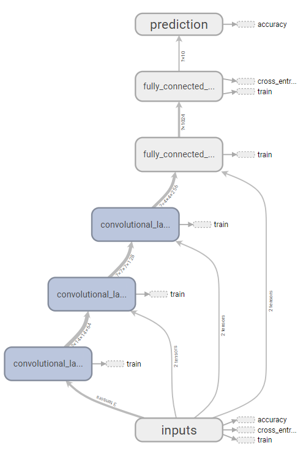
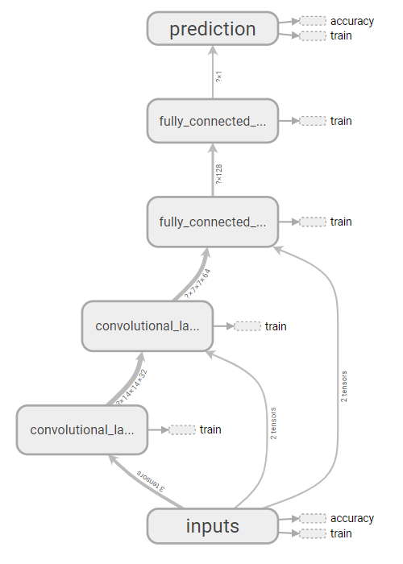

# 人智实验报告

## 概况

- 本文是一篇实验报告，主要介绍了这几天以来我对数字识别神经网络的设计与思考。
- 识别用的神经网络基于 CNN，训练框架为 TensorFlow GPU
- 目前在 Kaggle 平台上测得的最高识别准确率为 99.485%，提交次数 15
- Github 仓库地址：https://github.com/Konano/homework-digit-recognizer

## 实验流程与结果

### 最基础的 CNN

首先对于数字识别这类图像识别问题，卷积神经网络 CNN 是一个常用且实际效果优秀的解决方案。于是我们先尝试用最简单的 CNN 来实验。

我在 TensorFlow 上新建了一个由两卷积层、两池化层和两全连接层构成的 CNN。卷积层的卷积核大小为 $5 \times 5$，第一层卷积核个数为 $1 \times 32$，第二层为 $32 \times 64$，激活函数为 Relu；池化层采用 MaxPooling，大小为 $2 \times 2$，步长为 $2 \times 2$；全连接层第一层的输入规模为 $7 \times 7 \times 64 = 3136$，由第二个池化层的输出一维化而成，其大小为 1024 个神经元；全连接层第二层大小为 10；最后输出 10 个实数，分别表示图像是对应数字的概率。初始化时 weight 为随机正态分布，biases 为零值加上一个小常数。对于准确性，这里用了交叉熵函数来作为衡量神经网络优劣的指标。


我将官网提供的大小为 42000 的训练数据划分成两部分，前 41000 为训练集，后 1000 为验证集。在对前者训练了 30 次之后，交叉熵为 0.05165，识别率为 97.342%。

### 第一轮实验

接着我对最基础的 CNN 进行参数调整，继续进行实验。

| 调整内容                                            | 训练 30 次后对于验证集的交叉熵 |
| --------------------------------------------------- | ------------------------------ |
| 初始网络                                            | 0.05165                        |
| 将卷积层的特征映射图数量从 32、64 增加至 64、128    | 0.03757                        |
| 增加第三个全连接层                                  | 1.146                          |
| 将第一个全连接层大小从 1024 增加至 2048             | 0.04125                        |
| 给全连接层加入 Dropout 机制                         | 0.08944                        |
| 将卷积核大小从 5 缩小至 4                           | 0.03280                        |
| 将卷积核大小从 5 缩小至 4 且增加新的卷积层 & 池化层 | 0.03755                        |


可见实验效果最好的是第 6 组：缩小卷积核大小。由此我们能得知神经网络并不是越大越好，过大的神经网络更容易过拟合，训练效果时间增加（如第 3 组，如此高的交叉熵意味着其收敛速度极慢）。

最后第 6 组在 Kaggle 上的识别准确率为 99.185%，第一次高于 99%。

### 第二轮实验

感觉 30 轮训练依旧不够使得网络收敛，于是第二轮实验的训练轮数增加到 50 轮。

同时，第一轮交叉熵实现为

```python
prediction = tf.nn.softmax(h_fc2)
cross_entropy = tf.reduce_mean(-tf.reduce_sum(ys * tf.log(prediction), reduction_indices=[1]))
```

由于 `prediction` 可能会出现 0，这会使得 cross_entropy 等于 NAN(not a number)。

为了修复这个 Bug，在第二轮实验中，将交叉熵实现改为

```python
cross_entropy = tf.reduce_sum(tf.nn.softmax_cross_entropy_with_logits(logits=h_fc2, labels=ys))
```

第二轮实验的初始网络是在第一轮实验的初始网络的基础上进一步修改而得的：

- 第一个全连接层的大小增加至 2048
- 全连接层增加 Dropout 机制，概率 0.5（防止过拟合）
- 三层卷积层，特征映射图数量从前往后依次是 64、128、256

接下来依旧是修改参数进行实验：

| 调整内容 | 训练 50 次后对于验证集的交叉熵 |
| -------- | ---- |
| 初始网络 | 56.24 |
| 卷积层增加 Dropout 机制，概率 0.75 | 37.16 |
| 卷积层增加 Dropout 机制，概率 0.75；卷积核大小改为 4 | 31.10 |
| 卷积层增加 Dropout 机制，概率 0.75；卷积核大小改为 4；第一个全连接层的大小改为 1024 | 36.17 |


由表可知给卷积层加入 Dropout 机制的效果是十分明显的。同时由第 2、3 组的比较可知适宜的卷积核大小为 4，由第 3、4 组的比较可知适宜的全连接层大小为 2048。

将第 3 组的训练次数提升至 200，最后在 Kaggle 上的识别准确率为 99.485%



然后我尝试多次初始化神经网络，并进行 10 轮的训练，这样就得到了多个相同结构但参数不同的神经网络。然后取交叉熵最低的网络作为最优的神经网络进行 200 次训练，期待能得到一个更高的识别准确率。然而最后结果依旧是 99.485%，可知这种方式的提升作用是有限的。

### 第三轮实验

假如我们对于每个数字都单独训练一个 CNN 来识别，是不是会有更高的准确率？

于是我针对每个数字都单独训练了一个小的 CNN（两个卷积层，卷积核大小为 4，特征映射图数量从前往后依次是 32、64；一个全连接层，大小 128；卷积层和全连接层都有 Dropout 机制；输出一个小数，表示当前图像为某个特定数字的概率）



由于训练数据内包含的是十种数字的图像，在训练单一数字的时候，非当前数字的图像要比当前数字的图像多得多，这会使得网络在训练后直接走向一个极端（输入啥得到的概率都为 0），必须对训练数据做一些调整，例如重复使用当前数字的图像数据，或者舍弃一些非当前数字的图像数据，使得两者数量接近一致。

最后让每个 CNN 训练 200 次，再将其组合起来得到一个神经网络组。最终其在 Kaggle 上的识别准确率为 94.000%。


## Todo

- 尝试除 Relu 以外更多激活函数
- 让学习率不再是一个常数，而是一个变化量，随训练轮数的增加而变小
- 尝试更多初始化参数方法

## 总结

- 神经网络大小要适宜，太小的网络处理不了复杂的数据，太大的网络既训练太慢又容易过拟合
- 训练时间不易过长，否则容易过拟合，或者产生梯度消失问题
- Dropout 能十分有效地减弱过拟合的问题
- 对于图像识别分类问题，可以对每个分类都训练一个神经网络，然后再组合成一套大的神经网络